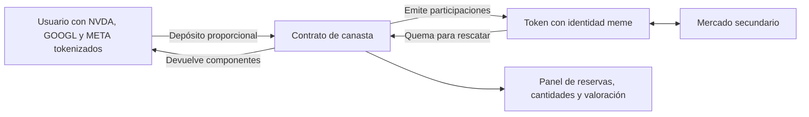

# Meme asociado a varias acciones: evaluación técnica

14 de septiembre de 2026. Investigación y lecturas públicas; sin firma, aprobación ERC-20, transacción, despliegue ni compra. No se implementó un contrato que custodie fondos.

## Decisión propuesta

Para que el token represente la evolución de una canasta de IA, el propio token con identidad meme debe ser una participación rescatable en un contrato con varios activos. La prueba inicial debería tener tres componentes, una sola red y entradas/salidas proporcionales en esos componentes. El humor y el nombre no requieren otro token financiero.

Robinhood Chain es candidata para el prototipo porque se verificaron allí los activos relevantes. **No está acreditada una ruta de producción lista para usar en Long ni una integración de Reserve compatible con esos activos.** La investigación permite diseñar la prueba; no justifica desplegar con dinero.

## Arquitecturas comparadas

| Alternativa | Implementación | Qué obtiene el holder del meme | Dictamen |
|---|---|---|---|
| A. Un MEME, tres pools | MEME/NVDA, MEME/GOOGL, MEME/META con el mismo contrato MEME | Tres mercados; ninguna participación automática en reservas | Posible como mecánica meme. No replica una canasta |
| B. Pool MEME/AI-BASKET | Crear o integrar una canasta ERC-20 y usarla como activo de cotización | Exposición al precio MEME/AI-BASKET; no un derecho automático sobre la canasta | Conserva especulación meme y agrega una dependencia; no satisface seguimiento del índice |
| C. MEME es la participación | El contrato recibe varios tokens y emite participaciones; el rescate quema participaciones y devuelve componentes | Un derecho onchain sobre las cantidades del contrato, sujeto a transferibilidad de cada activo | Recomendación para la idea original |
| D. Un pool ponderado de varios activos | AMM tipo Balancer con MEME y varias acciones | El token de LP representa el pool; MEME por sí solo no | Alternativa válida si el producto fuera la participación LP, con riesgo de AMM |

Uniswap v4 identifica cada pool por dos monedas y otros parámetros; multicurve significa varias curvas de liquidez, no varias acciones de respaldo. Los pools adicionales necesitan MEME y activos de cotización financiados: desplegar no crea ese capital. Una asignación inicial del 100% del MEME al primer pool obliga a adquirir o reservar explícitamente el inventario de los demás. [Uniswap PoolManager](https://developers.uniswap.org/docs/protocols/v4/concepts/poolmanager), [Doppler Multicurve](https://www.doppler.lol/multicurve.pdf).

Para A, cada pool v4 tendría una `PoolKey` con monedas ordenadas, comisión, `tickSpacing` y hook. Hay que validar permisos de transferencias, inventario, rangos, propietario de las posiciones LP y el recorrido de vuelta. No se pueden trasladar los ingresos del hook de Long a otro pool por suponer que el contrato MEME es el mismo. B requiere que el DEX o el launchpad acepte el contrato de la canasta como cotización; esa aceptación no fue verificada.

Balancer v3 documenta hasta ocho tokens y pesos fijos en su WeightedPool. No se comprobó un despliegue compatible en Robinhood Chain ni se propone instalar todo ese protocolo para el piloto. Las comisiones LP compensan actividad de trading y pueden no cubrir pérdidas frente a mantener los activos. [Contrato WeightedPool](https://github.com/balancer/balancer-v3-monorepo/blob/main/pkg/pool-weighted/contracts/WeightedPool.sol).

## Evidencia actual

Catálogo oficial consultado a las **21:40:42 UTC**: 194 activos. Lectura RPC fijada al bloque **63134544**, hash `0xe116e06ea7ed170f9f71ee2f5427aa16f27779e9bd72ffe29f9c8eae21012d2f`, timestamp **21:42:17 UTC**. El JSON adjunto conserva la identidad del bloque y las respuestas originales.

| Token | Contrato, chain 4663 | Resultado |
|---|---|---|
| NVDA | `0xd0601CE157Db5bdC3162BbaC2a2C8aF5320D9EEC` | Activo en API, código presente, 18 decimales; `paused=false`, `oraclePaused=false` |
| GOOGL | `0x2e0847E8910a9732eB3fb1bb4b70a580ADAD4FE3` | Activo en API, código presente, 18 decimales; `paused=false`, `oraclePaused=false` |
| META | `0xc0D6457C16Cc70d6790Dd43521C899C87ce02f35` | Activo en API, código presente, 18 decimales; `paused=false`, `oraclePaused=false` |
| MSFT | `0xe93237C50D904957Cf27E7B1133b510C669c2e74` | Activo en API, código presente, 18 decimales; `paused=false`, `oraclePaused=false` |
| AIQ / ARTY | — | No encontrados en este snapshot del catálogo; no prueba ausencia universal |
| QQQ / SPY | Ver snapshot | Sí aparecen; ninguno constituye por sí mismo una canasta exclusiva de IA |

Esto verifica existencia e interfaces de lectura. No demuestra profundidad ejecutable, autoridad del emisor sobre transferencias, permisos de una futura bóveda ni reservas fuera de la cadena. Las direcciones se contrastaron con el [catálogo oficial](https://api.robinhood.com/rhj/assets); [descripción de las APIs](https://docs.robinhood.com/chain/stock-token-apis/).

### Long y Bankr

El constructor local de Long capturado el 8/9 utiliza un solo `numeraire`. La factory histórica `0x22e99278308B393ea1260859B181AD7E78f5eeED` respondió `paused=true` en el bloque de esta investigación. **No se comprobó que sea la factory que usa hoy el frontend**; la conclusión se limita a esa dirección. No corresponde evitar esa pausa enviando directamente a otro contrato.

La documentación pública de Bankr describe `pairedStockAddress`; no se encontró una lista de acciones con pesos. La cotización por token personalizado en Base está limitada a una lista explícita y no debe interpretarse como aceptación de cualquier canasta. [API de Bankr](https://docs.bankr.bot/token-launching/api-reference/deploy-token-launch/), [documentación completa](https://docs.bankr.bot/llms-full.txt).

### Reserve

Se descargó el código, sin ejecutarlo, del commit **18706fb455b8e6b91250deba795eb791243f6827**, fechado 24/8/2026. `Folio` ya contiene mint/rescate por varios activos, límites de salida y mecanismos de rebalanceo. Es una referencia concreta para C.

Sin embargo, su README marca **Pausable / Blocklist como no soportado**. Nuestros activos exponen `paused()`: la compatibilidad de sus transferencias y autoridades debe comprobarse. En el código, el rescate transfiere los componentes en una misma transacción; si un componente revierte, revierte el rescate completo. Envolver el activo no elimina la capacidad de su emisor de congelarlo. No se evaluó ninguna mitigación productiva.

El commit incluye gobernanza y comisiones; no es un vault neutro ni queda auditado por existir informes de versiones anteriores. No se verificaron un deployment de esta versión en Robinhood ni su correspondencia con un informe de auditoría. [README fijado](https://github.com/reserve-protocol/reserve-index-dtf/blob/18706fb455b8e6b91250deba795eb791243f6827/README.md), [Folio fijado](https://github.com/reserve-protocol/reserve-index-dtf/blob/18706fb455b8e6b91250deba795eb791243f6827/contracts/Folio.sol).

## Diseño de la prueba de C



**Un solo ERC-20 representa la participación.** No hay otro token de gobernanza necesario para probar esta mecánica. Supply variable según depósitos/rescates; no se deben regalar participaciones sin aportar su respaldo. La transferencia entre holders no cambia las reservas. Las comisiones de gestión, si se añadieran, deben contabilizarse como dilución o retiro explícito.

Módulos propuestos, todavía no implementados:

| Componente | Responsabilidad |
|---|---|
| `BasketShare` | Lista ordenada de tres activos, participaciones ERC-20, emisión y rescate proporcionales |
| UI | Previsualizar cantidades, permisos exactos, límites de ejecución y estado de activos |
| Lector público | Reservas, supply, pausas, multiplicadores, antigüedad de precios y transacciones |
| `BasketRouter`, fase posterior | Cambiar un activo de pago por componentes y depositarlos; o rescatar y venderlos |
| Rebalanceador, fase posterior | Ejecutar un cambio de pesos con límites y permisos explícitos |

API conceptual: `previewMint(shares)`, `mint(shares,maxAmountsIn,receiver,deadline)`, `previewRedeem(shares)` y `redeem(shares,minAmountsOut,receiver,deadline)`. No son métodos ya publicados por un contrato nuestro. Verificar diferencias de balances y rechazar transferencias con impuestos/comportamientos incompatibles; guardia de reentrada y transacciones atómicas. Aprobar cantidades acotadas a destinos conocidos.

Si hay `S` participaciones y `B_i` unidades enteras de cada token:

- Para emitir `s`: aportar `ceil(s × B_i / S)` de cada componente.
- Para rescatar `s`: recibir `floor(s × B_i / S)` de cada componente.
- La inicialización se diseña aparte: semilla y participaciones iniciales atómicas, mínimos y límites contra ataques al primer depósito/donaciones.

Ese cálculo no necesita un precio USD: conserva cantidades por participación y evita emitir barato por un oráculo desactualizado. Tampoco necesita vender activos para rescatar en especie. **No elimina congelaciones del emisor.** Si una transferencia falla, la primera prueba revierte toda la operación y conserva el estado anterior. Una salida parcial con derechos sobre activos congelados exigiría contabilidad y revisión adicionales; no se presume resuelta.

V1: composición fija, sin préstamos, puentes ni rebalanceo. Los pesos iniciales en dólares pueden ser iguales, pero cambian con los precios; sería una canasta buy-and-hold, no un índice que mantiene 33/33/33. Agregar rebalanceo transforma el alcance y obliga a medir ejecución, pérdidas por deslizamiento y autoridad del administrador.

ERC-4626 estandariza un solo activo de entrada/salida. No alcanza con heredar una implementación y pasarle tres tokens. Un vault 4626 denominado en una stablecoin puede gestionar una estrategia multi-activo, pero requiere la capa de valoración y ejecución que aquí se difiere. [ERC-4626](https://eips.ethereum.org/EIPS/eip-4626).

## Valoración y flujo desde dólares

Para el panel: `NAV = suma(balanceRaw_i / 10^decimals_i × precioPorToken_i)`; dividir por supply normalizado para el NAV por participación. Precio del mercado y valor de respaldo deben mostrarse separados.

Los oráculos de Robinhood ya incluyen el multiplicador por dividendos y acciones corporativas. Aplicarlo otra vez sobrevalúa el respaldo. Los tres feeds históricos leídos tenían 3942, 7916 y 3964 segundos desde su última actualización; no se revalidaron sus heartbeats ni su registro actual. No se utilizan esas lecturas como cotizaciones ejecutables. [Oráculos oficiales](https://docs.robinhood.com/chain/oracles-and-price-feeds/).

La fase con entrada en stablecoin necesita rutas reales y límites por componente. Un router podría adquirir las tres cantidades, emitir participaciones y devolver sobrantes en una transacción **solo si toda la liquidez necesaria existe onchain y las rutas son atómicas**. Una suscripción al emisor fuera de cadena exige otro flujo, posiblemente asíncrono. Si no hay una ruta o falla un mínimo, revertir; no dejar al usuario con una compra parcial invisible.

El rescate base entrega tokens de acciones, no dólares, acciones en un broker ni derechos de accionista. No permite crear nuevos stock tokens: la emisión primaria de Robinhood corresponde a participantes autorizados. [Naturaleza y emisión de Stock Tokens](https://docs.robinhood.com/chain/stock-tokens/).

## Pruebas necesarias y esfuerzo

| Etapa | Criterio de éxito | Estimación de ingeniería, no compromiso |
|---|---|---|
| Prueba local/fork con tres activos | Depositar, transferir participaciones y rescatar sin dilución; demostrar fallos y rollback | 5–10 días hábiles para un ingeniero con experiencia Solidity, si RPC y fuentes están disponibles |
| UI y conversión desde stablecoin | Compra/rescate con límites, devolución de sobrantes y datos verificables | 1–2 semanas adicionales, condicionado a liquidez e integración |
| Piloto con fondos | Versión y permisos revisados, congelaciones decididas, revisión independiente, capital/liquidez y restricciones resueltas | No se estima responsablemente antes de la prueba |

Ensayos pendientes: transferencias reales en fork desde holders de prueba; pausas y bloqueos; supply cero/dust/donaciones; redondeos/decimales; fallo en el segundo o tercer activo; reentrada; multiplicador y split; precios viejos y mercado cerrado; restricciones del receptor; salidas bajo estrés; cambios de implementación del emisor. Gas y profundidad requieren ejecución simulada con contratos, cantidades y bloque concretos. Los activos iniciales de la canasta y la liquidez de su mercado son necesidades de capital distintas.

En esta evaluación sí se ejecutaron **750 estados matemáticos** de emisión/rescate proporcional y dos ejemplos económicos en `check-mechanics.mjs`. No son ensayos EVM. El ejemplo de tres AMM sin comisiones muestra +29,52% para el MEME frente a +33,33% de una canasta equiponderada cuando una acción duplica y las otras quedan iguales, bajo supuestos explícitos de arbitraje y balances. Demuestra que varios pares no definen el mismo producto que una participación.

## Evidencia y reproducción

- `collect-sources.mjs`: GET públicos, guarda archivos, fechas, HTTP y SHA-256; nunca ejecuta el código descargado.
- `probe-robinhood.mjs`: whitelist de cinco métodos RPC de lectura, bloque común y transcript. Reutiliza la instalación existente de viem; no se añadieron dependencias.
- `check-mechanics.mjs` y `mechanics-results.json`: modelo aritmético y alcance explícito.
- `evidence/2026-09-14T21-40-42.572Z/manifest.json`: catálogo y código fijado. Blockscout devolvió 403 y la ruta Markdown de Bankr 404; se conservaron como errores, no evidencia de inexistencia.
- `evidence/rpc-2026-09-14T21-42-21.043Z/snapshot.json`: contratos y estado observado; el archivo contiene el hash real del bloque.
- `evidence/rpc-2026-09-14T21-42-21.043Z/rpc-transcript.json`: llamadas y respuestas.
- `bankr-llms-full.txt` dentro de la carpeta de fuentes: descarga posterior de la documentación pública completa; procedencia en su manifiesto adicional.

Desde la raíz del repo:

```powershell
node docs/research/ai-meme-multistock-2026-09-14/check-mechanics.mjs
node docs/research/ai-meme-multistock-2026-09-14/collect-sources.mjs
# Usar la carpeta que devuelve el recolector:
node docs/research/ai-meme-multistock-2026-09-14/probe-robinhood.mjs <carpeta-de-fuentes>
```

La recomendación técnica es validar C con depósitos en especie y tres componentes. Para un meme libremente especulativo, A también puede implementarse, pero habría que presentarlo como mercados contra varias acciones, sin atribuirle seguimiento de índice ni derechos sobre reservas.
