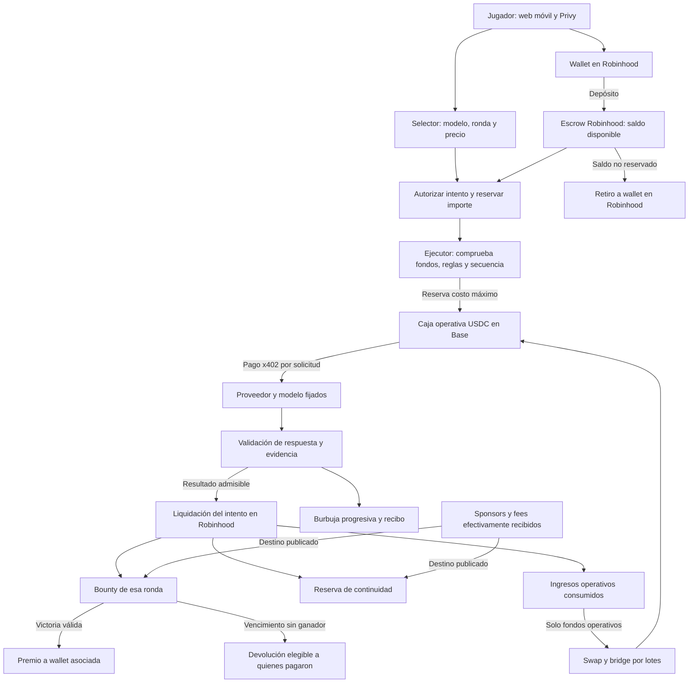
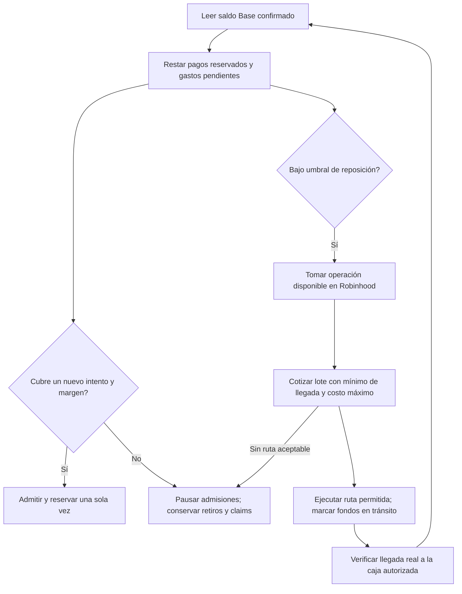

# Vault: mapa del lanzamiento en Robinhood

15/09/2026 · Propuesta de arquitectura; no describe un sistema mainnet ya implementado.

**Actualización de política del mismo día:** el usuario está dispuesto a vender créditos sin retiro ordinario. El [registro de decisiones de beta paga](../plans/2026-09-15-vault-paid-beta-decisions.md) propone créditos de juego, restauración por error y devolución excepcional al cerrar/no prestar el servicio. La selección técnica es x402 como primera integración, con OpenRouter para práctica. Las referencias a retiro ordinario de este mapa describen el diseño anterior; no son una condición nueva ya aplicada ni deben borrarse para balances históricos. La separación de fondos, claims de premio y devolución por vencimiento se mantiene.

**Acceso público preparado:** el runtime admite `VAULT_PUBLIC_ADMISSION=true` para que cualquier cuenta autenticada entre sin invitación, conservando pausa, límites y catálogo de modelos. El valor por defecto sigue cerrado. Esta preparación no activa fondos ni cambia la beta desplegada.

**Decisión del usuario:** el juego sale en Robinhood Chain. El jugador deposita, autoriza intentos, retira saldo y cobra premios en esa red. Base puede usarse detrás para pagar un proveedor de IA; nunca será un requisito de wallet para jugar. Activo inicial propuesto: USDG existente. El token de Long queda para una integración posterior, con liquidez y contratos verificados.

**Recomendación:** cobrar/reservar cada intento en Robinhood y pagar cada inferencia con USDC mediante x402. Mantener una pequeña caja operativa en Base y reponerla automáticamente agrupando ingresos operativos ya consumidos. Eso evita hacer un bridge por cada mensaje. El tamaño inicial de esa caja está pendiente y es independiente de los hasta USD 500 de semilla del premio.

## 1. Mapa general

Las cajas representan componentes propuestos. Las flechas de fondos no representan una única transacción atómica entre redes.



El ejecutor, el verificador y la autoridad aceptada por el escrow aún deben calificarse. Una firma de nuestro servidor o una transferencia x402 no prueban que la inferencia fue imparcial.

## 2. Qué verá y firmará el jugador

1. Entra, conecta su wallet en Robinhood y ve la ronda, el premio ganable, las reglas y su saldo.
2. Recarga un importe en el activo admitido. Ese saldo sigue respaldado en Robinhood hasta consumirlo; no se convierte entero a créditos del proveedor.
3. Elige modelo desde el chat. Cada opción muestra precio, estado y bounty propio; modelos de práctica no acceden al premio. V1 recomendada: un guardián con fondos, otros de práctica.
4. Escribe y autoriza un intento con precio máximo, wallet beneficiaria, ronda, modelo/configuración y vencimiento definidos. El precio puede diferir entre modelos; un saldo no equivale a una cantidad universal de intentos.
5. Ve estados claros: confirmando → procesando → respuesta validada. Después aparece la escritura progresiva, reacción de la cara y reparto del intento.
6. Puede abrir el recibo o reclamar premio, retirar saldo disponible y, si corresponde, solicitar devolución por vencimiento.

**Primera integración:** una transacción de admisión por intento, además del depósito. ERC-20 puede exigir una aprobación inicial; las cotizaciones de Relay recibidas devolvieron dos pasos: `approve` y `deposit`. No prometer una sola firma total ni gas gratuito. El usuario necesita ETH para gas o un patrocinador con presupuesto explícito. Permisos de sesión o batching se evalúan después, con límites de importe, duración y contratos.

La alternativa de pago directo por intento puede combinar ingreso y reserva en el escrow, pero tampoco garantiza que aprobación y transferencia sean una sola transacción. El contrato debe admitir solo el intento exacto autorizado: nunca una aprobación para gastar arbitrariamente desde el chat.

Telegram es una segunda entrada al mismo circuito: bot → enlace de autorización web → misma wallet, saldo, ronda e intento → respuesta también en Telegram. No dar claves al bot ni crear premios o saldos paralelos. Queda fuera del primer lanzamiento web.

## 3. Qué existe para convertir y pagar la IA

### Evidencia obtenida sin mover dinero

- La documentación oficial de Robinhood publica Relay y LI.FI como opciones de bridge/swap entre redes. El bridge canónico hacia Ethereum tiene un período de salida de aproximadamente siete días: no sirve para esperar cada mensaje. [Robinhood bridging](https://docs.robinhood.com/chain/bridging/).
- Mainnet Robinhood usa chain ID `4663`; testnet `46630`. La documentación publica USDG `0x5fc5360D0400a0Fd4f2af552ADD042D716F1d168`. Eso no sustituye revisar permisos, emisor y contratos antes de financiar. [Red](https://docs.robinhood.com/chain/connecting/), [activo](https://docs.robinhood.com/chain/contracts/).
- Las APIs públicas de Relay y LI.FI listaron mainnet 4663. La presencia en catálogo por sí sola no demuestra una ruta ejecutable para cualquier token.
- Relay devolvió HTTP 200 para cotizaciones USDG Robinhood → USDC Base de 1 y 10 USDG. Dirección sintética `0x1`, sin firma, wallet conectada ni broadcast. [API de cotización](https://docs.relay.link/references/api/get-quote-v2).
- BlockRun documenta pago x402 en USDC Base, entre otras redes, sin endpoint Robinhood en su lista consultada. La investigación anterior recibió HTTP 402 para una solicitud sin key. Todavía no se pagó una inferencia en este circuito. [Endpoints](https://blockrun.ai/docs/x402/endpoints), [reporte anterior](PER-PROMPT-PAYMENTS-RESEARCH-2026-09-15.md).

Muestra guardada el 15/09 a las 18:41 UTC; cotizaciones variables, ya no utilizables como precio de ejecución:

| Envío en Robinhood | Salida cotizada en Base | Salida mínima de la cotización | Impacto USD informado, sin gas de origen | Gas de origen estimado |
| --- | --- | --- | --- | --- |
| 1 USDG | 0,946001 USDC | 0,907310 USDC | 0,054076 USD / 5,41% | 0,020277 USD |
| 10 USDG | 9,942054 USDC | 9,743213 USDC | 0,058779 USD / 0,59% | 0,019467 USD |

No sumar nuevamente `relayer`, `relayerGas` y `relayerService` al impacto: contienen componentes relacionados. Tampoco confundir valor USD con unidades de stablecoin. Los defaults de slippage del proveedor no se aceptan como política de Vault. El gas de aprobar ERC-20 y el del escrow requieren una medición propia; esta tabla no es el costo completo de jugar.

La API estimó dos segundos; no se midió entrega ni finalidad. La cotización prueba descubrimiento de ruta, no que la wallet, el contrato de Vault, su simulación o una transferencia real funcionen. No se probó el token Long ni su liquidez.

Evidencia: [JSON resumido](../../vault-lab/output/payment-research/robinhood-relay-quotes-20260915.json). Reproducción sin pagos: ejecutar `node audit/robinhood-payment-route-probe.mjs` desde `vault-lab`. Se descartan calldata e identificadores de ejecución.

## 4. Dos formas de conectar ese circuito

| | A: convertir al ejecutar cada intento | B: pagar cada intento y convertir por lotes |
| --- | --- | --- |
| Jugador | Siempre Robinhood | Siempre Robinhood |
| Dinero para la primera inferencia | Se espera la conversión del importe autorizado | Pequeña caja USDC propia previamente financiada |
| Conversión | Una por intento, si hay ruta para ese importe | Agrupa exclusivamente ingresos operativos realizados |
| Demora | Confirmación + bridge + proveedor | Confirmación + proveedor mientras haya caja |
| Costos | Fee y gas de bridge repetidos | Se amortizan entre varios intentos |
| Riesgo operativo | Cruce pendiente, quote vencida, devolución entre redes | Caja insuficiente, reposición demorada, custodia operativa limitada |
| Estado | Ruta para importes de 1/10 USDG cotizada; no micropagos ni ejecución | Arquitectura recomendada; automatización por construir |

**Recomiendo B para la beta paga.** Cada usuario deja pagado su intento, pero el movimiento físico entre redes se agrupa. No hace falta una cuenta OpenRouter muy cargada: hace falta liquidez operativa pequeña y acotada en una wallet. No es cero capital inicial.

Si se exige cero anticipo operativo, usar A y mostrar la espera y el costo completo antes de autorizar. Una ruta para 1 USDG no prueba viabilidad para el costo de una consulta de fracciones de centavo. Cotizar `EXACT_OUTPUT` para el presupuesto real, slippage estricto y contratos definitivos será parte del ensayo. No cobrar primero para descubrir después que el bridge cuesta más que lo cobrado.

La conversión por lotes sale de fondos operativos ya liquidados. El bounty, los saldos retirables y la reserva de continuidad no cruzan a Base para subsidiar inferencias. El futuro token Long requerirá una ruta verificable hacia un activo aceptado por el bridge; un nombre de token o ticker no crea esa liquidez.

## 5. Secuencia propuesta por intento: modalidad B

```mermaid
sequenceDiagram
  actor J as Jugador
  participant Q as Cotizador
  participant E as Escrow Robinhood
  participant W as Ejecutor y presupuesto
  participant I as Proveedor x402
  participant V as Verificador
  J->>Q: Modelo y prompt
  Q->>I: Cotizar solicitud exacta sin pagar
  I-->>Q: Importe, activo, red y vencimiento
  Q-->>J: Precio máximo y reparto; regla y beneficiario
  J->>E: Autorizar y reservar un intento único
  E-->>W: Admisión confirmada y secuencia
  W->>W: Reservar USDC disponible y presupuesto de error
  alt Falta liquidez o venció el precio
    W->>E: Cancelación verificable o timeout contractual
    E-->>J: Liberar lo reservado según reglas
  else Hay cobertura y configuración válida
    W->>I: Request fijo y autorización x402 acotada
    I-->>W: Respuesta y recibo de pago
    W->>V: Evidencia, intento, configuración y respuesta
    V-->>E: Resultado verificable ligado al intento
    E->>E: Liquidar una sola vez y registrar aportes
    E-->>J: Resultado, claim si ganó y recibo
  end
```

El cotizador no ejecuta la inferencia. Compromete el request completo: system prompt, historial, herramientas, límites, modelo y proveedor. Repetir una cotización sin inferir es distinto de regenerar respuestas. Si vence el precio, solo se recotiza dentro del máximo autorizado y sin modificar la solicitud; de otro modo se cancela. No aceptar fallback de modelo ni truncamiento silencioso en una ronda con fondos.

Una firma de transferencia x402 no liga por sí sola el texto del prompt. El identificador de intento y el hash del request tienen que quedar vinculados a la evidencia admitida por el escrow. No hay una transacción atómica que abarque Robinhood, Base y una respuesta HTTP: se necesita una máquina de estados, conciliación y plazos.

En V1, serializar intentos elegibles de una misma ronda: no dejar varias inferencias compitiendo por un premio ya ganado. Futuras colas necesitan un orden verificable y devolución de reservas que queden sin ejecutar al cerrar la ronda.

## 6. Bolsillos separados y precio

| Bolsa | Qué contiene | Quién puede recibirla |
| --- | --- | --- |
| Disponible | Depósitos todavía no consumidos | Su wallet, mediante retiro |
| Reservado | Máximo autorizado para un intento pendiente | Liquidación reglada o devolución a su saldo |
| Bounty | Premio de esa ronda | Ganador; o devolución por vencimiento según manifiesto |
| Continuidad | Aporte separado para futuras rondas | Nuevas semillas con piso y tope publicados |
| Operación en Robinhood | Fracción de intentos liquidados para costos | Adapter de conversión y gastos autorizados |
| Operación en tránsito / Base | Liquidez propia o ingresos convertidos | Proveedor permitido, devolución o retorno operativo |
| Reserva de errores | Fondos propios para costos sin resultado válido | Restituir reservas del jugador y absorber pérdidas |

Propuesta de precio: `P = B + R + O`, con importes fijos por modelo/ronda o tabla publicada. `O` debe cubrir el peor costo admitido de IA, conversión amortizada, gas pagado por el sistema, errores y operación. La contribución a juego no puede calcularse suponiendo que cualquier respuesta cuesta lo mismo.

El ejemplo anterior 70/20/10 sigue siendo una hipótesis. Puede aplicarse solamente si el 20% cubre esos costos con margen; de lo contrario se cambia el precio/split antes de abrir la ronda o se subsidia explícitamente. No se corrigen porcentajes sobre intentos ya vendidos. El gas pagado directamente por el jugador se muestra aparte.

Ejemplo contable, no tarifa: recarga 10 USDG, consume 1; quedan 9 retirables. Si la tarifa aprobada fuera 70/20/10, 0,70 alimenta bounty, 0,10 continuidad y 0,20 operación. Se repone la caja Base usando ese 0,20 realizado, no usando los otros 9. Los costos deben caber ahí. Si falla una respuesta cuyo proveedor cobró, la propuesta es devolver el precio del intento desde reserva de errores; el gas de red ya gastado no es reversible y debe explicarse.

La cotización en USD es informativa. La contabilidad y los derechos se expresan en unidades del activo de la ronda. Si Long es volátil, definir activo del premio, conversión, costo de IA y riesgo de precio antes de vender intentos; no redenominar saldos existentes.

## 7. Reposición automática y prevención de vaciamiento



- Dimensionar caja y umbral con costo máximo por request, concurrencia global, demora adversa de reposición y presupuesto de incidentes; no fijar un número porque un bridge prometió dos segundos.
- Una reserva no puede cubrir dos llamadas. Los fondos en tránsito no cuentan como disponibles en Base. Restar también pagos ambiguos hasta conciliarlos.
- Limitar importe por lote/día, destinatario, tokens, cadenas, router y slippage. Validar calldata; una respuesta del agregador no autoriza una llamada arbitraria. Sin allowance ilimitada desde el escrow hacia un router general.
- Publicar balances operativos y movimientos, distinguiendo caja propia, ingresos, tránsito y pagos. El historial x402 evidencia un pago, no justifica por sí solo su elegibilidad como gasto del juego.
- Un modelo solo puede liberar el bounty de su ronda. El premio anunciado es completamente ganable; la continuidad se muestra aparte. Al ganar se cierra la ronda y se retira esa configuración del catálogo pago.
- Nueva ronda: nueva configuración evaluada, semilla limitada y reserva por encima del piso. Si no alcanza, no abre. Un cooldown no arregla un jailbreak conocido.
- Limitar bounty máximo y admisiones; reglas y precios congelados. Precios que suben con el bounty son una opción posterior con fórmula pública, no una modificación discrecional durante V1.
- Ni creator fees futuras ni donaciones prometidas respaldan obligaciones. Solo fondos efectivamente recibidos y asignados según sus términos.

Esto busca continuidad financiada. No promete un juego infinito ni servicio sin interrupciones: sin entradas suficientes o con proveedores/red caídos se pausa antes de exponer más fondos.

## 8. Resultado, devoluciones y fallos

| Evento | Comportamiento requerido |
| --- | --- |
| No hay quote, modelo, ruta o presupuesto | No admitir/cobrar un intento nuevo |
| Pago de origen sin confirmar | No inferir; esperar finalidad y conciliar |
| Bridge operativo pendiente | No enviarlo otra vez ni contar la llegada antes de verificarla |
| Proveedor cobró y respuesta se perdió | Estado ambiguo; recuperar el mismo resultado, no volver a muestrear |
| Modelo/proveedor distinto, salida inválida, truncamiento | Error técnico, nunca derrota automática; aplicar devolución financiada |
| Guardián rechaza legítimamente | Liquidar precio, sumar contribuciones y mostrar recibo |
| Guardián libera según criterio congelado | Cerrar admisiones y hacer reclamable el bounty a la wallet vinculada |
| Intento pendiente excede deadline | Timeout contractual público; invalidar resultados tardíos y conciliar costo aparte |
| Ronda vence sin ganador | Tras resolver/caducar pendientes, habilitar devolución a pagadores elegibles |
| Operador fuera de línea | Retiros, claims y timeouts ejecutables sin su permiso |

La condición de ganar debe especificar una acción/salida estructurada y su validación, no la aparición de la palabra “yes”. El contrato valida la autorización de resultado y su vínculo al intento; no interpreta lenguaje natural. Publicar el prompt no demuestra por sí solo qué ejecución ocurrió.

Devolución al vencer: `fondo reembolsable × contribución elegible de esa wallet / total elegible`. La semilla y donaciones no se incorporan automáticamente: su destino al vencer depende de términos explícitos. Los créditos sin consumir se retiran por otra vía. El 75% del bounty elegible, combinado con 70% del precio destinado a bounty, devuelve 52,5% de los pagos elegibles, no 75% del gasto total. Porcentaje, duración de 30 o 180 días y destino de remanentes siguen por definir antes de abrir.

Claims mediante retiros individuales, sin recorrer todas las wallets ni depender de publicar una lista manual. Contabilizar por dirección receptora y evitar doble claim. Los derechos no se venden junto con el token. Montos mínimos, plazos de claim y polvo deben estar en el manifiesto.

## 9. Custodia y pruebas: qué significa cada promesa

| Promesa | Evidencia necesaria | Límite que hay que declarar |
| --- | --- | --- |
| Fondos respaldados | Contrato verificado, balances por activo, obligaciones y claims conciliados | Mostrar un balance de wallet no demuestra solvencia si se omiten pasivos |
| No retiro discrecional | Escrow sin funciones que desvíen premios/saldo; roles y upgrades verificables | Una multisig fundador + agente controlado por fundador no elimina ese control |
| Reglas congeladas | Manifiesto ligado on-chain a ronda, precios, modelo, prompt, payouts y deadlines | Un hash solo prueba compromiso con datos, no la ejecución de esos datos |
| Resultado admisible | Evidencia independiente de request/respuesta/configuración y autoridad autorizada | TEE de gateway no prueba necesariamente el modelo remoto; x402 solo prueba pago |
| No seleccionar muestras | Admisión única, orden externo persistente, prevención de clones/rollback y reinferencia elegible | “Una fila por intento” en SQLite no basta |
| Transparencia operativa | Recibo con intento, costos, txs, destino, resultado y procedencia de evidencia | No publicar secrets, emails ni datos privados como sustituto de auditoría |

Rol recomendado de una multisig: administración operativa limitada y cambios para rondas futuras. No poder rescatar premios a voluntad, cambiar beneficiarios ni vetar claims válidos de una ronda activa. La clave que paga x402 tiene una caja acotada y no puede gastar el escrow. El modelo tampoco recibe esa clave.

Queda abierto el mecanismo concreto de autoridad verificable, incluida unicidad y resistencia a reinicios. Si solo podemos probar una respuesta del servidor, no anunciar “proof of fair” criptográfico. La primera prueba técnica debe resolver esta limitación antes de comprometer premios reales. Freysa sigue como referencia, no como certificación: [agent](https://github.com/0xfreysa/agent), [sovereign-freysa](https://github.com/0xfreysa/sovereign-freysa).

## 10. Orden de implementación y primera versión

1. **Economía y alcance:** Robinhood obligatorio; USDG candidato; un guardián pago; tabla de precio máxima; monto de caja, reserva de errores, split, plazo y exposición total. Simular pérdida inmediata, modelos caros, retiradas masivas y bridge caído.
2. **Ensayo de ruta y proveedor:** contratos definitivos, quote con slippage propio, transferencia mínima autorizada, x402 real, recuperación e idempotencia, sin fallback. Medir costo/latencia y reembolso. No se hizo todavía.
3. **Ensayo de autoridad:** comprobar qué garantiza la evidencia de IA y cómo impedir elegir otra muestra. Un pago exitoso no desbloquea este requisito.
4. **Contratos testnet:** disponible/reserva/consumido, orden de intentos, ronda, premio, continuidad, retiro y vencimiento. Pruebas de invariantes y roles antes de fondos reales.
5. **Servicios:** cotizador, reserva de presupuesto, ejecutor, validador, conciliador y reposición por lotes. Reusar auth/UI; mantener cada responsabilidad separada sin framework nuevo.
6. **UX web:** autorización Robinhood, costos visibles, estados pendientes, burbuja validada, recibos, retiro/claim y explicación breve de operación externa. No pedir al jugador que cambie a Base.
7. **Ensayo integral y revisión independiente:** concurrencia, restauración, vencimientos, errores cobrados, caída de infraestructura y permisos de contratos. Confirmar términos/eligibilidad del piloto antes de abrir pagos reales.
8. **Piloto:** hasta USD 500 de aporte a premio como límite indicado; 20–50 invitados como propuesta. Operación presupuestada aparte. Telegram, token Long, precios dinámicos y más guardianes después.

La beta actual permanece en testnet con OpenRouter. Este mapa no despliega escrow, cambia proveedor, configura recargas automáticas ni mueve dinero. El plan de ejecución asociado está en [primera versión financiada](../plans/2026-09-15-vault-first-funded-release.md).
