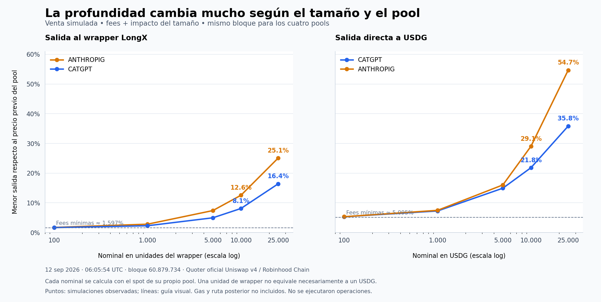

# Narrativas y espacio: actualización de las 03:12 ART

**Captura posterior:** [mercado hasta03:35ART](../round-04/MERCADO-0635.md). Los líderes IA y MONEY corrigieron en el siguiente intervalo; Base/BSC incorpora seis pools jóvenes con identidades y fuentes. Este dossier conserva las horas de sus tablas y auditorías.

12 de septiembre de 2026. Mercado: capturas de 06:12:36–06:12:47 UTC. Cultura: 05:48–06:07. Fees: historia cerrada a 05:52:06. Profundidad: todas las simulaciones al bloque de 06:05:54. Cada evidencia conserva su hora; no son cotizaciones simultáneas ni ejecutadas.

**La separación ahora es más clara: los pares IA concentran negociación, Steel conserva una expresión cultural reutilizable, y ninguno de esos hechos demuestra que quede una oportunidad lista para lanzar.** CATGPT tiene cobros y conversiones comprobables, pero la economía del creador es menor que la tarifa total del swap. En los derivados ALL hay reparto real sin una ventaja de adquisición demostrada.

Esta actualización sustituye las conclusiones operativas del [corte de 01:51 ART](../deep/DECISION.md), que se conserva como registro histórico. La investigación continúa en `../round-04/`, con un contraste de Base y BSC; los candidatos que aún se están verificando no se incorporan como recomendaciones confirmadas.

## Qué cambió y por qué importa

1. **El rebote reciente de algunos IA no recupera la caída anterior.** ANTHROPIG LongX subió 18,04% y CLAUDEGATOR 38,21% entre 05:50 y 06:12, pero seguían 21,68% y 73,74% debajo de 04:48. CATGPT perdió otro 1,15% en el intervalo corto. Son cambios observados en una cohorte fija, no una predicción.
2. **CATGPT sí produjo ETH transferido al receptor de fees.** Diecinueve ventas con cantidad, token y cuenta coincidentes con cobros cercanos entregaron 3,1931182453 ETH. Eso no representa todo el resultado económico del creador. Se reconstruyeron todas las trazas de esas diecinueve ventas.
3. **El contador USD de fees no puede leerse como caja realizada.** Valorar a precios recientes los tokens históricamente cobrados reproduce casi exactamente el contador de LONG. El mecanismo exacto de la UI sigue sin verificar, pero la cifra no prueba dólares cobrados ni inventario actual.
4. **La salida directa a USDG tiene un costo propio elevado.** Los dos pools secundarios examinados cobran 5,095% combinado antes del impacto de tamaño. A un nominal de 10.000 USDG al spot de cada pool, la venta simulada pierde 21,84% en CATGPT y 29,05% en ANTHROPIG frente a ese spot.
5. **Better Call Steel sí circula.** Ocho autores posteriores al corte anterior usaron la expresión. Corrige el resultado negativo previo: ya había posts a 04:07 y 04:24, así que es un descubrimiento nuevo para esta investigación, no una frase que nació ahora. El STEEL seguido solo negoció US$5,01 en la hora reciente.

## Winners observados y continuidad

MC, liquidez y volumen son valores reportados por DEX Screener. Volumen no es entrada neta ni prueba de organicidad. Todas las variaciones cortas de esta tabla comparan la misma captura aproximada de 05:50 con la de 06:12, unos 22 minutos después.

| Pool exacto | MC USD | Volumen 1h USD | Liquidez USD | Cambio 05:50→06:12 | Lectura |
| --- | ---: | ---: | ---: | ---: | --- |
| [CATGPT / OPENAIx1L](https://dexscreener.com/robinhood/0x086f510359ad57e4f8588b71ffa21fe29bbed044e4d13aa2f72ecaefeda95a36) | 7.649.740 | 435.557 | 4.891.878 | −1,15% | Líder de escala entre estos IA; −15,66% desde 04:48. Liquidez nominal no es efectivo vendible. |
| [ANTHROPIG / ANTHROPICx1L](https://dexscreener.com/robinhood/0xaf28b153a45c4647ed76860811f734152e3c93e29c6a4489691954b71716d310) | 2.146.677 | 122.567 | 1.449.444 | +18,04% | Rebote parcial; −21,68% desde 04:48. |
| [CLAUDEGATOR / ANTHROPICx1L](https://dexscreener.com/robinhood/0xbfe91882eba961ca01ee3f21b864b299d48402d47dfc48d5a977b077b934319c) | 217.485 | 39.976 | 176.520 | +38,21% | Rebote desde una caída mayor; −73,74% desde 04:48. |
| [MONEY / SPY](https://dexscreener.com/robinhood/0x13c339deb9ea2f31a6616e89aa097940667d77fa5de2de063f7bcf04b75dd8e5) | 1.288.556 | 49.071 | 93.586 | +9,43% | Continuidad de precio más fuerte de este grupo; +110,42% desde 04:11. No prueba nuevo catalizador. |
| [STONK / SOL](https://dexscreener.com/solana/zxtpi4btawx3mgdapoezkmd1hxx8cdecfrqxmwvsclx) | 230.074.017 | 1.532.072 | 4.722.929 | +0,94% | Escala y actividad; −0,85% desde 04:11. No convierte a cada derivado en oportunidad. |
| [ALL / SOL](https://dexscreener.com/solana/uzak8txfjavqs9vhtdayawfbiybzwq4bzxdifjtqenj) | 1.941.960 | 336.949 | 157.688 | −17,57% | Pierde fuerza respecto del corte previo; −37,32% desde 04:11. |
| [FLYBRAIN / USDG](https://dexscreener.com/robinhood/0x6191331ead43b8876ea312020ca58e539c51ef48021b3b93fac2718893c0b771) | 9.705.648 | 128.947 | 365.926 | −1,13% | Sigue activo; −14,49% desde 04:11. Hay que separar su origen de otros tokens de moscas. |
| [iNu / AAPL](https://dexscreener.com/robinhood/0x7e271c400427ecb727f5fbb27dec69254bce7c4219e95e3535d0ed128f79648a) | 2.516.481 | 74.124 | 463.552 | +12,93% | Rebote reciente, aún −23,41% desde 04:11. |

**Torres gemelas no lidera esta actualización.** El 911/BA seguido quedó con MC US$10.511, volumen horario US$130,31 y cero compras frente a tres ventas. Es un pool concreto y una ventana concreta; no es un censo de todos los intentos 911. [Pool exacto](https://dexscreener.com/robinhood/0x30f31e2ae9a6dfb0caf0713758074c5fe05a3bc0706b271fe41df09cf196d930).

El otro ANTHROPIG, CA `0x04d6AAa3147B9f5b5dB255d3151561c07019BDC6`, emparejado con WETH, cayó 49,31% entre 05:50 y 06:12 y 73,50% desde 04:12, pese a US$2,814 M de volumen horario. **Es otro token**, con MC US$2,764 M y liquidez US$200.557. No sumar su comunidad, volumen o contratos a ANTHROPIG LongX. El feed público además mostraba 100 boosts para ese contrato: promoción no equivale a organicidad.

La cohorte completa de esta ronda conserva **42 pools exactos**: 18 winners previos, 11 pares IA fijos, seis adicionales y siete culturales. Selección heredada, no muestra aleatoria del mercado. Las bases históricas de esos grupos tienen horas diferentes. Evidencia: [intervalo de 22 minutos](tracked-interval.json), [primer corte](tracked-first.json), [segundo corte](tracked-second.json).

## Lo que recibe el creador de CATGPT

La auditoría completa encontró 16 cobros positivos: **1.848.755,2105 CATGPT + 5.500,0837 OPENAIx1L** al beneficiario. Collect recoge del pool al contrato; Release distribuye al beneficiario. Sumarlos duplicaría el mismo flujo.

La participación inicial del creador es 95% del componente LP de **0,2%**, nominalmente 0,19% de la base de ese fee. El hook terminal de **1,4%** sigue otra distribución hacia un integrador; no es todo ingreso del creador. La tarifa compuesta pequeña del swap principal es aproximadamente 1,5972%, antes de otros costos. La revisión contrastó código, calldata, eventos y transferencias reales. [Contrato initializer](https://robinhoodchain.blockscout.com/address/0x4e3468951D49f2EEa976eD0D6e75fFCb44a9a544?tab=contract), [hook](https://robinhoodchain.blockscout.com/address/0x6f02324d20CC679d0E585290CAa6b16baCbC0F77?tab=contract).

| Flujo histórico identificado | Resultado |
| --- | ---: |
| Seis ventas de 1.271.697,9648 CATGPT | 0,7661189692 ETH al receiver |
| Trece ventas de 5.034,7279 OPENAIx1L | 2,4269992761 ETH al receiver |
| Total de esas 19 ventas | **3,1931182453 ETH** |
| Gas de esas ventas | 0,0008550598 ETH |
| Comisión adicional transferida por el router | 0,0322537196 ETH, separada del pago anterior |
| Gas de los 16 cobros LP | 0,0004864027 ETH |

Los 3,1931 ETH ya son el pago al receiver tras la separación de la comisión del router; no descontarla otra vez. Las diecinueve concordancias usan cuenta, token, cantidad exacta y proximidad de hasta 30 segundos respecto de un cobro. La fungibilidad del inventario impide identificar físicamente qué unidad se vendió; se excluyeron cantidades mezcladas. No es un P&L completo: faltan compras, otras conversiones, capital, lanzamiento y costos propios. [Ejemplo de venta y pago](https://robinhoodchain.blockscout.com/tx/0x1ac3ebba1b720d2587657e740d8f566c785a1064223427d67531458b4ab31f72).

Valorar todo lo históricamente cobrado a precios de 05:50 da **US$20.193,83**, frente a **US$20.203,79** en el contador CLAIMED de 05:53: diferencia 0,0493%. Compatible con valorización actual; fórmula de UI no comprobada. No llamarlo saldo actual ni dólares realizados. ANTHROPIG LongX tuvo cero Collect/Release al corte: eso no significa cero devengado.

La reconstrucción de beneficiarios, rotación, schedule del hook y las 19 trazas está en [fees/LECTURA.md](fees/LECTURA.md). Allí se explica también la discrepancia entre el comentario del código y su denominador ejecutable.

## Qué tan cara es una salida

Las 48 cotizaciones se simularon en el mismo bloque **60.879.734 de 06:05:54 UTC**, mediante el quoter oficial de Uniswap v4 y el RPC público de Robinhood. PoolKeys recalculadas desde eventos Initialize; decimales leídos por contrato. Sin wallet, firma ni transacción enviada. [Despliegues oficiales](https://developers.uniswap.org/docs/protocols/v4/deployments), [RPC documentado](https://docs.robinhood.com/chain/connecting/).

| Tamaño nominal al spot del propio pool | CATGPT → USDG recibido | Desvío frente al spot | ANTHROPIG → USDG recibido | Desvío frente al spot |
| ---: | ---: | ---: | ---: | ---: |
| 100 USDG | 94,685465 | 5,315% | 94,664123 | 5,336% |
| 1.000 USDG | 927,346920 | 7,265% | 925,260060 | 7,474% |
| 5.000 USDG | 4.253,418734 | 14,932% | 4.198,504467 | 16,030% |
| 10.000 USDG | 7.816,224227 | 21,838% | 7.094,838783 | 29,052% |
| 25.000 USDG | 16.041,910227 | 35,832% | 11.334,983412 | 54,660% |

Estos dos pools tienen LP fee 5% y protocol fee 0,1% por dirección, combinados en **5,095%** por la fórmula multiplicativa de Uniswap. Es la configuración de esos pools, no una tarifa general de USDG. [Fórmula oficial](https://github.com/Uniswap/v4-core/blob/main/src/libraries/ProtocolFeeLibrary.sol).

En el pool principal, vender el equivalente al spot de **10.000 unidades de su wrapper** produjo desvíos 8,105% en CATGPT y 12,554% en ANTHROPIG. **10.000 OPENAIx1L, 10.000 ANTHROPICx1L y 10.000 USDG no son el mismo capital.** Cada pool usa una cantidad de memes normalizada a su propio spot; la tabla no elige una ruta óptima para idéntico inventario.

El desvío incluye fees e impacto de curva. No incluye gas, router, cambio posterior de precio, MEV ni convertir el wrapper a una moneda común. Una simulación de pool no certifica balances, permisos y ejecución futura de una wallet. Las cotizaciones públicas de Matcha mostraron rutas disponibles y otras con Revert, variando al refrescar; no se interpretaron como ejecución ni arbitraje. [Método, primer bloque y ampliación](depth/LECTURA.md), [raw de los cuatro pools](depth/quotes-four-pools.json).

## Qué espacio cultural queda

**Brian Steel / Better Call Steel sigue siendo el candidato más concreto para explorar una expresión propia entre los culturales revisados.** La frase apareció en ocho autores posteriores a 04:51, con dos posts de 2.081 y 1.103 vistas y seis de 3–49. Son mayormente respuestas o citas. El original de FearBuck creció de 1,99 a 2,248 millones de vistas; ese aumento pertenece al mismo post, no a otra audiencia independiente. [Ejemplo inglés](https://x.com/ngurufast/status/2098638411456287124), [ejemplo portugués](https://x.com/UnXDeath/status/2098642169787453852), [original](https://x.com/FearedBuck/status/2098567760829661472).

El STEEL seguido mantiene MC US$3.615,87 y solo US$5,01 de volumen horario; liquidez no informada. Las consultas exactas Better Call Steel, Call Brian Steel y Judgement/Judgment Day no devolvieron identidades exactas en sus primeros 30 resultados. **Eso no acredita exclusividad ni compradores.** El personaje tiene reutilización; su conversión a token sigue sin probarse.

ACME creció apenas 0,17% en vistas del mismo original. Warsaw no mostró renovación comparable de la frase exacta. Mbappé y Omos aportaron nuevos posts de amplia distribución, pero sobre hechos anteriores y sin un meme nuevo independiente suficiente en la muestra. [Informe cultural y fuentes](culture/REPORT.md).

La oportunidad residual defendible es **probar una expresión y su distribución**, con una escena que los autores ya reutilizan. No tenemos evidencia de una ventaja por elegir otro ticker 911, otro animal IA o el nombre que un buscador no devuelve. No se publicó ni lanzó una prueba.

## ALL: reparto real, adquisición aún sin demostrar

El listado congelado contiene **161 derivados: 154 con MC ≤US$10.000, cuatro mayores y tres sin precio**. Ochenta reportaban payouts y 81 no. La muestra de actividad se eligió con una regla explícita: los cuatro mayores y seis pequeños, uno con pagos y uno sin pagos en cada banda de edad 0–3 h, 3–6 h y 6 h+. No es aleatoria ni causal.

Los cuatro mayores negociaban. **Los seis pequeños no registraron compras en la última hora**, incluyendo tres con pagos; cinco tuvieron volumen cero y ALLAI solo tres ventas por US$45,30. Eso no demuestra que nunca negociaron ni que pagar cause fracaso.

Se comprobaron drops de ALLCAT, ALLDOG y ALLIN: **14 transferencias a 13 direcciones**, una repetida entre activos. Crear una cuenta de token no prueba una persona nueva. El contador global del operador mostraba 137.293 pagos, de los cuales 121.712 —88,65%— correspondían al activo ALL. No son 137.293 usuarios ni audiencia adquirida por los derivados. [Endpoint del operador](https://all-worker-production.up.railway.app/leaderboard).

Una distribución de creator fees de ALLAI dividió 0,001278112 SOL en cinco transferencias aproximadas 50/10/10/10/20. Es un split de creator fees, no del volumen total de trading. El trabajo confirma ejecución técnica del reparto; no demuestra atención voluntaria, retención o rentabilidad. [Recibo](https://solscan.io/tx/3jSqXwRhY4ED3Kf6v2E1aJE3nzBdHpj7p4jydxtAUcZRUiAqswc754CkMvVKmRfcyn5WTa1Bk65xHD6NPYp192Bz), [cohorte, muestra y comprobaciones](distribution/LECTURA.md).

## Decisión provisional y siguiente evidencia

| Pregunta | Respuesta al corte |
| --- | --- |
| ¿Dónde hay negociación? | STONK mantiene escala; IA/LongX tiene líderes activos, correcciones y rebotes. MONEY/SPY conserva mejor continuidad de precio que varios líderes de la selección. |
| ¿Quién ya capturó valor comprobable? | CATGPT tiene fees y conversiones históricas documentadas. Su resultado neto total no quedó establecido. |
| ¿Queda un nombre obvio libre? | No se encontró una ventaja defendible basada en ausencia de resultados. Los homónimos y pools secundarios hacen peligrosa una conclusión por ticker. |
| ¿Qué expresión cultural miraría? | Steel / Better Call Steel, por reutilización observable. El token seguido no acompaña esa actividad cultural. |
| ¿ALL resuelve la demanda inicial? | Prueba reparto, no adquisición. Los denominadores y la muestra de pequeños impiden inferir una ventaja de lanzamiento. |
| ¿Lanzar ahora está justificado? | La evidencia reunida todavía no lo justifica. Falta una demanda propia y continuidad que compense competencia y costos de salida. |

Siguiente ronda: verificar origen de candidatos en Base/BSC y contratos exactos de sus quotes, someter a revisión independiente la simulación/contabilidad, y actualizar la misma cohorte tras otro intervalo útil. Se mantiene el goal de investigación mientras quede cupo; no se compran créditos ni se ejecutan acciones financieras o de publicación.
